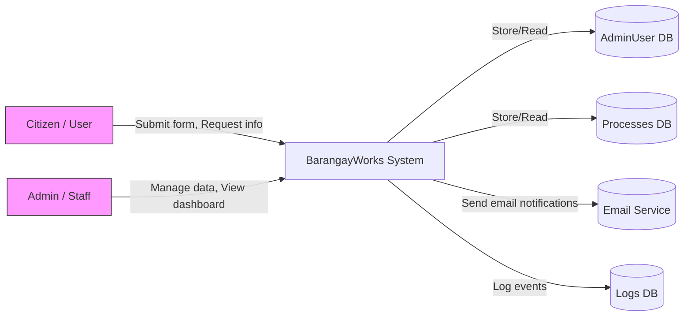
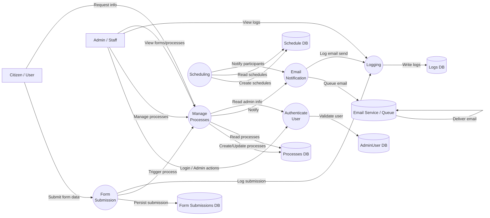

# Data Flow Diagram (DFD) — BarangayWorksJS

This document provides a context-level (Level 0) and a Level 1 Data Flow Diagram for the BarangayWorksJS application. The diagrams are written in Mermaid so you can preview or export them in VS Code with a Mermaid extension.

## Context-level DFD (Level 0)
Shows external entities, the system as a single process, and major data stores/services.

## Level 1 DFD
Decomposes the system into main processes and shows data flows between processes and data stores.

## How to use
- Open `DFD.md` in VS Code and use a Mermaid preview extension to render diagrams.
- Use the Level 1 diagram as a guide when implementing controllers and data flows.

Created: May 27, 2026
