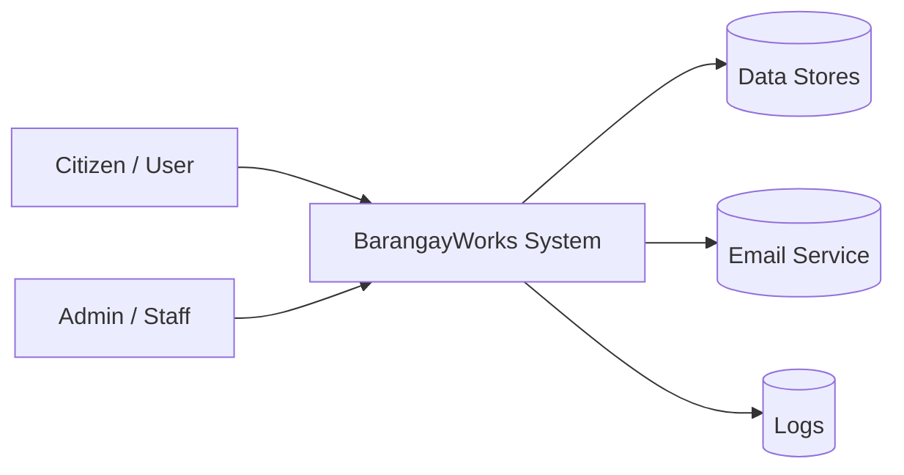
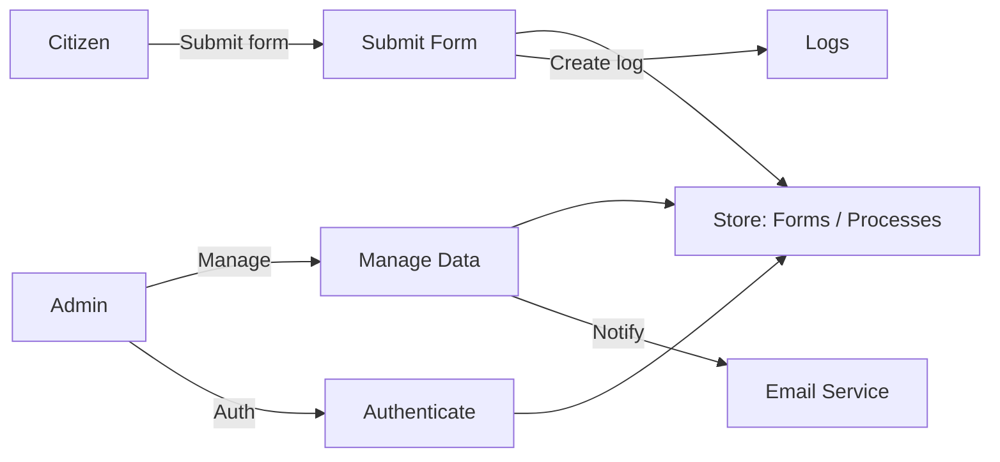

# Data Flow Diagram (DFD) — BarangayWorksJS

Quick, simplified DFDs for documentation and implementation guidance. Render the Mermaid blocks with a Mermaid extension.

## Context (Level 0)

## Level 1 (core processes)

Notes: data stores are grouped for brevity — map to `controller/` modules when implementing.

Created: May 27, 2026
