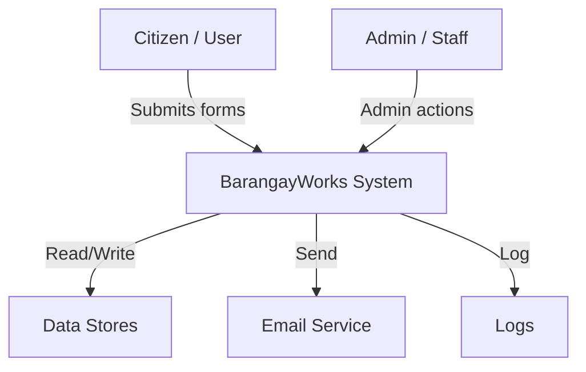
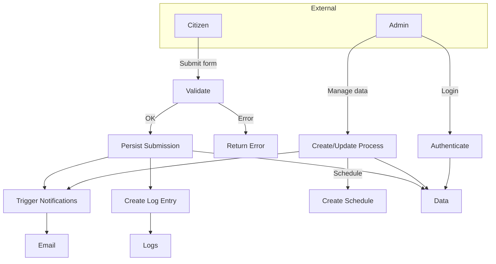

# Data Flow Diagram (DFD) — Flowcharts

Replaced the DFD diagrams with flowcharts (context-level and Level 1 process flow). Render the Mermaid blocks with a Mermaid extension.

## Context Flowchart

## Level 1 Flowchart (core processes)

Notes: these flowcharts show process steps and decision points (use alongside `ERD.md` for data modeling).

Created: May 28, 2026
