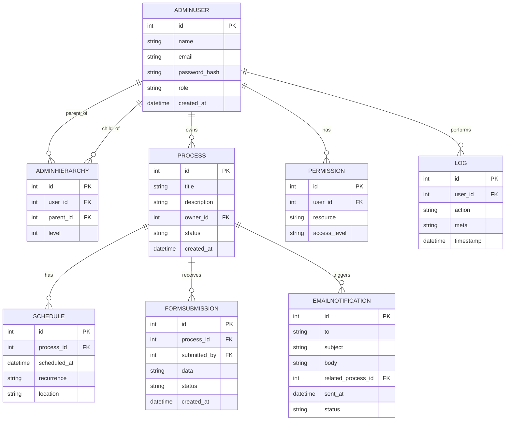

# Entity Relationship Diagram (ERD) — BarangayWorksJS

This document describes the main entities, attributes, and relationships used by the BarangayWorksJS application. It includes a Mermaid ER diagram you can render in compatible editors or convert to an image for documentation.

**Entities & Key Attributes**
- `AdminUser`: `id` (PK), `name`, `email`, `password_hash`, `role`, `created_at`
- `AdminHierarchy`: `id` (PK), `user_id` (FK -> `AdminUser.id`), `parent_id` (FK -> `AdminUser.id`), `level`
- `Process`: `id` (PK), `title`, `description`, `owner_id` (FK -> `AdminUser.id`), `status`, `created_at`
- `Schedule`: `id` (PK), `process_id` (FK -> `Process.id`), `scheduled_at`, `recurrence`, `location`
- `Permission`: `id` (PK), `user_id` (FK -> `AdminUser.id`), `resource`, `access_level`
- `FormSubmission`: `id` (PK), `process_id` (FK -> `Process.id`), `submitted_by` (FK -> `AdminUser.id`), `data` (JSON/text), `status`, `created_at`
- `Log`: `id` (PK), `user_id` (FK -> `AdminUser.id`), `action`, `meta` (JSON/text), `timestamp`
- `EmailNotification`: `id` (PK), `to`, `subject`, `body`, `related_process_id` (FK -> `Process.id`), `sent_at`, `status`

**Relationships (summary)**
- One `AdminUser` may own many `Process` records (1-to-many).
- `AdminHierarchy` represents parent-child relationships between `AdminUser` entries (self-referencing, many-to-one for child -> parent).
- Each `Process` may have many `Schedule` entries and many `FormSubmission` records (1-to-many).
- `Permission` entries tie `AdminUser`s to resources (many-to-many modeled as a permission table).
- `Log` entries record actions performed by `AdminUser`s (1-to-many).
- `EmailNotification` can be linked to a `Process` when notifications are process-related.

**Mermaid ER Diagram**

**Implementation notes**
- The repository contains lightweight DB modules under `controller/` (e.g., `adminhierarchydb`, `processesdb`, `scheduledb`) — align their table/field names with the ERD when persisting data.
- If you migrate to a relational DB (SQLite/MySQL/Postgres), map the JSON/text fields (`data`, `meta`) to JSON columns where supported.

**Next steps / Tips**
- Render the Mermaid block in VS Code (Mermaid preview) or convert it to an image for use in documentation.
- Keep this file updated when you change controllers or add new entities.

Created: May 27, 2026
