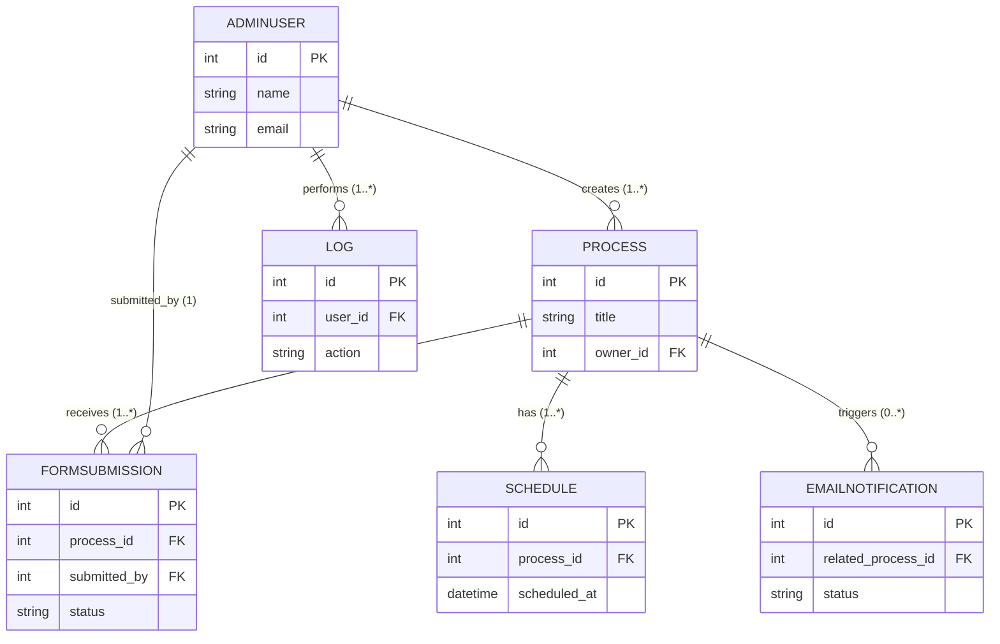

# Entity Relationship Diagram (ERD) — Simplified

This file contains a compact ER diagram for the core entities used by BarangayWorksJS plus a short legend. Render the Mermaid block in VS Code (Mermaid preview) to view.

**Legend**
- PK = Primary Key
- FK = Foreign Key
- 1 = one, * = many

**Simplified ER Diagram**

Notes:
- The diagram focuses on primary flows: users create processes; processes have schedules and form submissions; actions are logged; emails are triggered by processes.
- Keep `controller/` module field names aligned with these entities when implementing or migrating to an RDBMS.

Created: May 27, 2026
